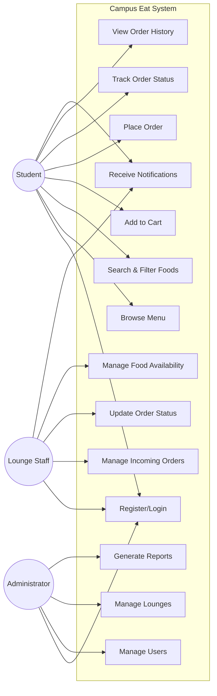
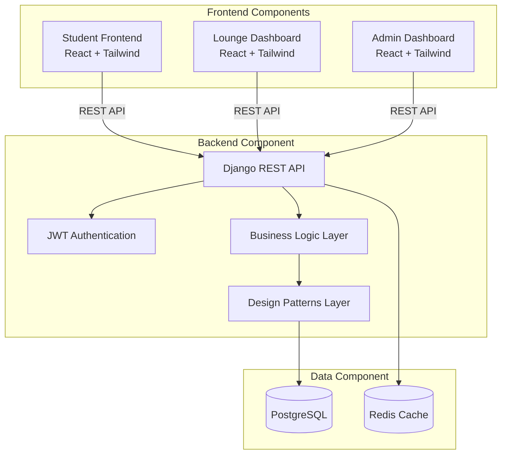
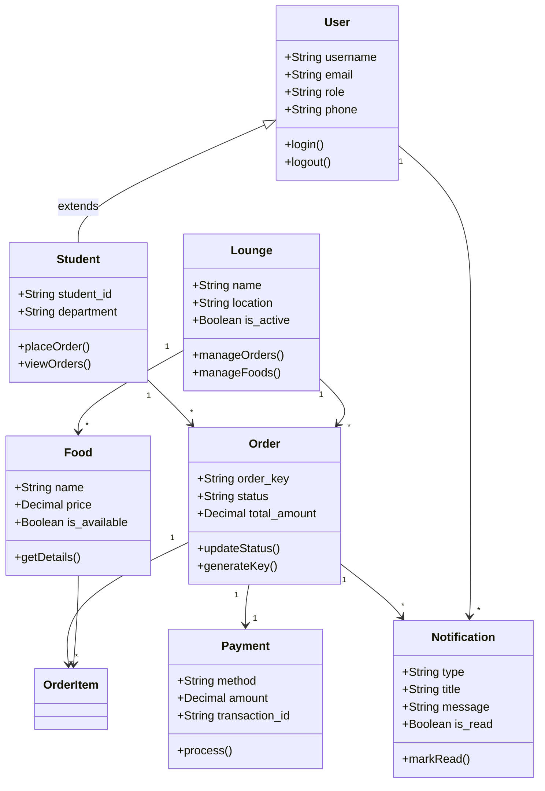
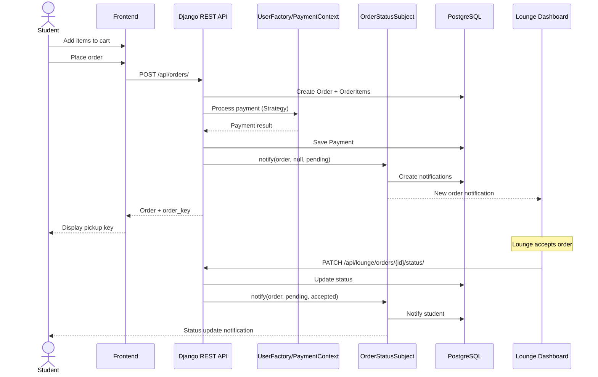
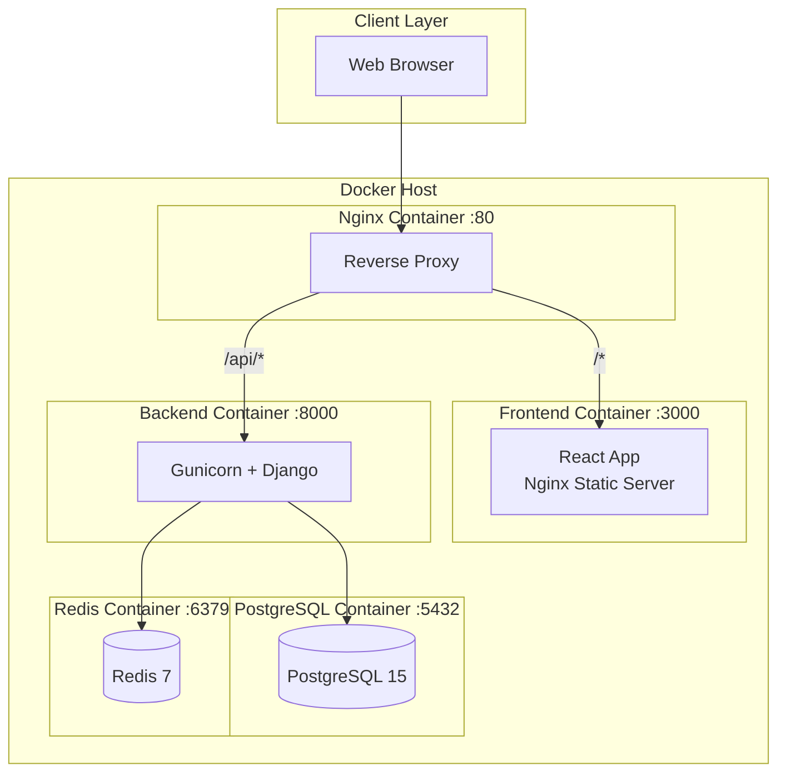

# UML Diagrams for Campus Eat

## 1. Use Case Diagram

```mermaid
graph LR
    Student((Student))
    Lounge((Lounge Staff))
    Admin((Administrator))

    subgraph Campus Eat System
        UC1[Register/Login]
        UC2[Browse Menu]
        UC3[Search & Filter Foods]
        UC4[Add to Cart]
        UC5[Place Order]
        UC6[Track Order Status]
        UC7[View Order History]
        UC8[Manage Incoming Orders]
        UC9[Update Order Status]
        UC10[Manage Food Availability]
        UC11[Manage Users]
        UC12[Manage Lounges]
        UC13[Generate Reports]
        UC14[Receive Notifications]
    end

    Student --> UC1
    Student --> UC2
    Student --> UC3
    Student --> UC4
    Student --> UC5
    Student --> UC6
    Student --> UC7
    Student --> UC14

    Lounge --> UC1
    Lounge --> UC8
    Lounge --> UC9
    Lounge --> UC10
    Lounge --> UC14

    Admin --> UC1
    Admin --> UC11
    Admin --> UC12
    Admin --> UC13
```

## 2. Component Diagram

```mermaid
graph TB
    subgraph Frontend Components
        SF[Student Frontend<br/>React + Tailwind]
        LD[Lounge Dashboard<br/>React + Tailwind]
        AD[Admin Dashboard<br/>React + Tailwind]
    end

    subgraph Backend Component
        API[Django REST API]
        AUTH[JWT Authentication]
        BL[Business Logic Layer]
        PAT[Design Patterns Layer]
    end

    subgraph Data Component
        PG[(PostgreSQL)]
        RD[(Redis Cache)]
    end

    SF -->|REST API| API
    LD -->|REST API| API
    AD -->|REST API| API
    API --> AUTH
    API --> BL
    BL --> PAT
    PAT --> PG
    API --> RD
```

## 3. Class Diagram

```mermaid
classDiagram
    class User {
        +String username
        +String email
        +String role
        +String phone
        +login()
        +logout()
    }

    class Student {
        +String student_id
        +String department
        +placeOrder()
        +viewOrders()
    }

    class Lounge {
        +String name
        +String location
        +Boolean is_active
        +manageOrders()
        +manageFoods()
    }

    class Food {
        +String name
        +Decimal price
        +Boolean is_available
        +getDetails()
    }

    class Order {
        +String order_key
        +String status
        +Decimal total_amount
        +updateStatus()
        +generateKey()
    }

    class Payment {
        +String method
        +Decimal amount
        +String transaction_id
        +process()
    }

    class Notification {
        +String type
        +String title
        +String message
        +Boolean is_read
        +markRead()
    }

    User <|-- Student : extends
    Student "1" --> "*" Order
    Lounge "1" --> "*" Order
    Lounge "1" --> "*" Food
    Order "1" --> "*" OrderItem
    Order "1" --> "1" Payment
    Order "1" --> "*" Notification
    User "1" --> "*" Notification
    Food --> OrderItem
```

## 4. Sequence Diagram - Order Placement

```mermaid
sequenceDiagram
    actor Student
    participant Frontend
    participant API as Django REST API
    participant Factory as UserFactory/PaymentContext
    participant Observer as OrderStatusSubject
    participant DB as PostgreSQL
    participant Lounge as Lounge Dashboard

    Student->>Frontend: Add items to cart
    Student->>Frontend: Place order
    Frontend->>API: POST /api/orders/
    API->>DB: Create Order + OrderItems
    API->>Factory: Process payment (Strategy)
    Factory-->>API: Payment result
    API->>DB: Save Payment
    API->>Observer: notify(order, null, pending)
    Observer->>DB: Create notifications
    Observer-->>Lounge: New order notification
    API-->>Frontend: Order + order_key
    Frontend-->>Student: Display pickup key

    Note over Lounge: Lounge accepts order
    Lounge->>API: PATCH /api/lounge/orders/{id}/status/
    API->>DB: Update status
    API->>Observer: notify(order, pending, accepted)
    Observer->>DB: Notify student
    Observer-->>Student: Status update notification
```

## 5. Deployment Diagram

```mermaid
graph TB
    subgraph Client Layer
        Browser[Web Browser]
    end

    subgraph Docker Host
        subgraph nginx_container [Nginx Container :80]
            NGINX[Reverse Proxy]
        end

        subgraph frontend_container [Frontend Container :3000]
            REACT[React App<br/>Nginx Static Server]
        end

        subgraph backend_container [Backend Container :8000]
            GUNICORN[Gunicorn + Django]
        end

        subgraph postgres_container [PostgreSQL Container :5432]
            PG[(PostgreSQL 15)]
        end

        subgraph redis_container [Redis Container :6379]
            RD[(Redis 7)]
        end
    end

    Browser --> NGINX
    NGINX -->|/api/*| GUNICORN
    NGINX -->|/*| REACT
    GUNICORN --> PG
    GUNICORN --> RD
```
